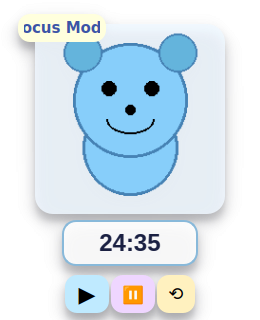
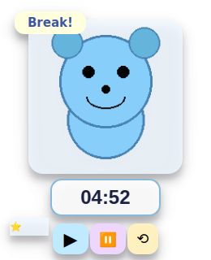

# AIDI Companion

AIDI is your sticky blue koala productivity buddy: Pomodoro, motivational AI chat, achievements, mood boosters, skins, and more.

## Screenshots

<div align="center">
  
  
  
</div>

*AIDI in action: Idle state, Focus Mode, and Break Mode with achievements*

For more screenshots, see the [screenshots](screenshots/) directory.

## Features

- Floating koala with Pomodoro timer
- Distraction/Afk detection, achievements, and stats
- Gen-Z assistant chat (offline: Ollama / cloud: HuggingFace)
- Custom mood boosters, affirmations, music suggestions
- Koala character skin selector
- System tray, keyboard shortcuts, accessibility
- Installable package (pip install .), one-click launch

## Installation

```bash
pip install .
aidi-companion
```

## Customization

- Add PNG/GIF koala images to `aidi/skins/`
- Add affirmations/music in "Mood Booster Settings"

## License

MIT (see LICENSE)